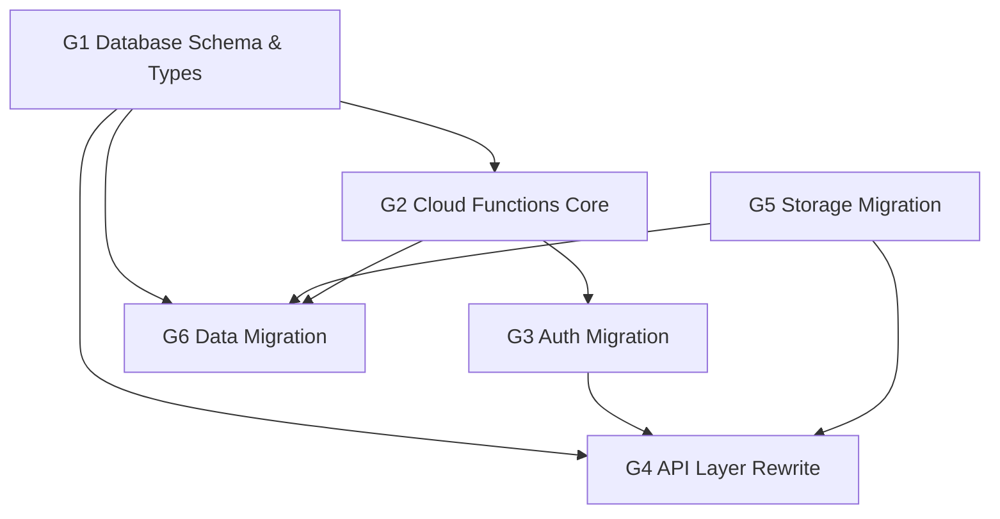

## Context

甜品点单小程序当前使用 Supabase 作为后端（PostgreSQL + Storage + Edge Functions + Auth），Supabase 节点部署在东京 (ap-northeast-1)，国内用户访问延迟高。项目已有微信云函数构建管道（`vite.config.ts` 中的 `compileWeixinCloud()` 插件），`weixin-cloud/` 目录已预留但为空。

当前 Supabase 使用范围：
- **数据库**: 5 张表 (users, products, orders, credits, categoried)，2 个触发器函数
- **认证**: Edge Function `wx-login` + JWT token 管理
- **存储**: 2 个 bucket (products-img, project-icons)
- **客户端 SDK**: `supabase-wechat-stable-v2`

关键约束：
- Supabase 为只读参考，不可修改
- 微信云数据库为文档型（类 MongoDB），无外键、无 CHECK 约束、无触发器
- 安全要求：所有写操作必须通过云函数服务端执行，客户端不可直接写数据库

## Goals / Non-Goals

**Goals:**
- 消除国内用户访问延迟（数据库和存储部署在国内）
- 利用微信云原生认证（`OPENID` 直接获取），简化登录流程
- 提升安全性：所有写操作通过云函数执行，服务端校验数据完整性
- 保持现有功能完全一致（点单、订单管理、积分、会员等级）
- 完成现有数据迁移

**Non-Goals:**
- 不重构 UI 或页面结构
- 不增加新功能
- 不做 H5 平台兼容（迁移后仅支持微信小程序，H5 清理后续单独处理）
- 不做实时数据同步（当前未使用 Supabase Realtime）

## Architecture Visualization

## Decisions

### D1: 认证方案 — 云函数 `getWxContext()` 替代 JWT

**选择**: 使用微信云函数的 `getWxContext()` 直接获取 `OPENID`，不再使用 Supabase Auth 的 JWT 机制。客户端仅调用 `wx.cloud.callFunction('user-login')`，无需 `wx.login()` —— 云函数调用本身自动携带用户身份。

**替代方案**:
- A) 在云函数中继续模拟 JWT 签发 → 复杂度高，无实际收益
- B) 使用微信云开发自带身份 + `wx.cloud.callFunction` 自带身份 → **选择此项**

**理由**: 微信云函数调用天然携带用户身份（`OPENID`），不需要 code2session 交换，也不需要 `wx.login()` 获取 code。前端登录流程从"uni.login → 调 Edge Function → 拿 JWT → 设置 token"简化为"调用云函数 → 自动获得 openid"。Token 管理逻辑（JWT 解析、过期检测、刷新）全部移除。

### D2: 数据模型 — 扁平化文档结构

**选择**: 保持 5 个集合的表结构基本不变，用应用层代码替代数据库约束。

**具体变更**:
- 移除外键约束，用云函数中的查询校验替代
- 移除 CHECK 约束（`order_status`、`level`），用 TypeScript enum + 云函数校验替代
- `users._id` 从 UUID 改为用 `openid` 作为文档 `_id`（天然唯一）
- `orders._id` 使用生成的 `order_id` 作为文档 `_id`，保证原子唯一性（文档 `_id` 插入时天然去重）
- `products._id` 保持原数据库中的数字 ID 作为文档 ID，以支持云函数事务中 `doc(id).get()` 查询
- `oder_details` 字段名保持原样（历史遗留拼写），避免数据迁移映射
- `categoried` 表名保持原样，集合名一致

### D3: 写操作 — 全部走云函数

**选择**: 所有写操作（创建订单、取消订单、积分变动、用户创建）都通过云函数执行，客户端不可直接操作数据库。

**理由**:
- Supabase 的 PostgREST + RLS 提供了隐式安全层，微信云没有等价物
- 客户端直写存在数据篡改风险（totalAmount、discountAmount）
- 积分和会员等级更新必须在服务端原子执行

**数据库安全规则**: 微信云数据库集合权限需显式配置：
- 客户端：仅允许 `products` 和 `categoried` 集合的读取权限（`read: true, write: false`）
- 云函数：通过 `cloud.database()` 获得管理员权限，所有写操作由云函数执行
- `users`、`orders`、`credits` 集合：客户端无直接读写权限

### D4: 存储迁移 — 微信云存储 + fileID

**选择**: 商品图片和分类图标迁移到微信云存储，数据库中存储微信云 `fileID`（`cloud://...` 格式）。

**替代方案**:
- A) 使用外部 CDN（七牛、阿里 OSS）→ 需要额外配置和费用
- B) 微信云存储 → **选择此项**，与生态一致，无需额外域名配置

**图片 URL 处理**:
- 数据库中存储微信云 `fileID`（`cloud://...` 格式），用 `&` 分隔多个 fileID（fileID 规范不含 `&` 字符，此分隔符安全）
- 前端通过 `wx.cloud.getTempFileURL()` 将 fileID 转换为可显示的临时链接（有效期 2 小时，需缓存并处理过期刷新）
- 商品图片和分类图标统一使用 fileID 格式
- 历史订单中的 Supabase URL：数据迁移时批量替换为 fileID

### D5: 触发器逻辑 — 迁移到云函数

**选择**: `handle_order_credits` 和 `update_user_level` 的逻辑内嵌到订单相关云函数中。

**具体方案**:
- `createOrder` 云函数：创建订单后 → 计算积分 → 更新 credits → 检查并更新 level
- `cancelOrder` 云函数：更新状态后 → 扣减积分 → 检查并更新 level
- 不使用微信云数据库触发器（功能有限且调试困难）

**积分语义**: `total_scores` 为累计积分（只增不减，取消订单时也扣减以反映真实消费），`available_scores` 为可用积分（当前与 `total_scores` 同步增减，未来可用于积分兑换等消耗场景）。当前业务中两者始终保持一致。

### D6: 环境变量 — 简化配置

**选择**: 移除 `VITE_SUPABASE_URL` 和 `VITE_SUPABASE_PUBLISHABLE_KEY`，微信云配置通过 `project.config.json` 和云函数环境管理，无需前端环境变量。

### D7: 订单金额语义

**选择**: `total_amount` 为折前金额（商品原价 × 数量之和），`discount_amount` 为总折扣金额。实付金额 = `total_amount - discount_amount`。积分计算基于实付金额。

**理由**: 现有代码 `cartStore` 发送 `totalAmount: cartStore.originalAmount`（折前金额）和 `discountAmount: cartStore.totalDiscount`（折扣），云函数验证时使用相同公式。

### D8: 构建管道 — 递归编译云函数

**选择**: 更新 `compileWeixinCloud()` Vite 插件，从仅编译顶层文件改为递归遍历子目录。每个云函数以 `weixin-cloud/<function-name>/index.ts` 格式组织，编译后输出为 `dist/dev/mp-weixin/weixin-cloud/<function-name>/index.js`。

**理由**: 当前插件仅处理 `weixin-cloud/` 下的直接文件（`if (!file.isFile()) continue`），跳过子目录。计划中的云函数结构需要递归支持。

### D9: 迁移切换策略

**选择**: 采用一次性切换（big bang）策略，迁移步骤：
1. 发布新版本小程序（含微信云代码），提交微信审核
2. 审核通过后，停用旧版本
3. 执行数据迁移脚本，将 Supabase 数据导入微信云数据库
4. 验证迁移完整性（记录数、关联性、fileID 映射）
5. 上传存储资源到微信云
6. 开放新版本

**回滚方案**: 保留旧版本小程序代码分支。如果迁移后发现问题，可回滚到旧版本重新提交审核。Supabase 保持运行不删除，作为回滚后备。

**理由**: 小程序当前处于开发阶段，用户量小，不存在大量并发订单写入的风险。一次性切换比增量同步简单得多。

### Implementation Sequencing

- **G1 Database Schema & Types**: 基础，无依赖。定义微信云数据库集合结构和 TypeScript 类型
- **G2 Cloud Functions Core**: 依赖 G1。创建云函数基础设施和通用工具
- **G3 Auth Migration**: 依赖 G2。实现新的认证流程
- **G4 API Layer Rewrite**: 依赖 G1 + G3 + G5。重写前端 API 层
- **G5 Storage Migration**: 依赖 G1。迁移存储资源
- **G6 Data Migration**: 依赖 G1 + G2 + G5。执行数据迁移

### Validation Strategy

- G1: TypeScript 编译通过 (`pnpm type-check`)
- G2: 云函数单元测试覆盖积分计算和会员等级逻辑
- G3: 登录流程端到端验证（新用户注册 + 老用户登录）
- G4: 每个页面功能验证（首页加载、下单、查看订单、个人中心）
- G5: 图片和图标正确加载
- G6: 迁移后数据完整性校验（记录数对比 + 关联性验证 + fileID 映射正确性 + 重复 ID 检测）

### Design Pivot Boundaries

**允许的调整**:
- 云函数内部实现细节（如积分计算的临时变量命名）
- 图片 URL 拼接方式（fileID vs 临时链接）
- 错误处理的具体错误消息措辞

**必须暂停审查**:
- 认证方案变更（如保留 JWT）
- 数据模型结构变更（集合增减、字段变更）
- 安全模型变更（如允许客户端直写）
- 订单号生成策略变更

## Over-Engineering Traps

- **不要**为云函数引入复杂的中间件框架。每个云函数是独立函数，保持简单。
- **不要**自建 ORM。微信云数据库 API 已经足够简洁。
- **不要**过度抽象存储层。`wx.cloud.getTempFileURL()` 直接用即可。
- **不要**为积分计算引入事务补偿框架。微信云数据库支持事务，直接用。

## Risks / Trade-offs

### [文档型数据库无关系约束] → 应用层校验

PostgreSQL 的外键、唯一约束、CHECK 约束在微信云数据库中不存在。需要在云函数中手动校验数据完整性（如 `order_status` 合法值、`openid` 唯一性）。

**缓解**: 在云函数中使用数据库事务 (`db.runTransaction`) 保证原子操作。TypeScript enum 类型在前端提供编译期检查。使用文档 `_id` 天然唯一性保证 order_id 和 display_id 的原子去重。

### [云函数事务限制] → doc() 操作 + 提前验证

微信云数据库事务仅支持 `doc(id).get()` / `doc(id).update()` / `doc(id).set()` / `collection.add()`，不支持 `where()` 查询。事务限制 100 次操作、30 秒超时。

**缓解**:
- 订单验证：事务外读取产品信息（`doc(product_id).get()`），事务内仅执行写操作
- 购物车大小限制：前端限制最多 20 件商品（远低于 100 次操作上限）
- order_id 唯一性：使用 `order_id` 作为文档 `_id`，利用数据库天然去重

### [Supabase 图片 URL 失效] → 数据迁移时批量替换

历史订单 `oder_details` 中的图片 URL 和 `categoried` 表中的图标 URL 都是完整 Supabase URL。迁移后这些 URL 会失效。

**缓解**: 数据迁移脚本批量扫描并替换所有 Supabase Storage URL 为微信云 fileID。

### [云函数冷启动] → 首次请求延迟

微信云函数首次调用有冷启动延迟。

**缓解**: 保持云函数精简，避免加载大型依赖。

### [wx.cloud.init() 失败] → 重试 + 降级

云初始化可能因网络或配置问题失败。

**缓解**: `App.vue` onLaunch 中 `wx.cloud.init()` 需包裹 try-catch，失败时显示重试提示，不阻塞页面渲染（页面按需重试初始化）。

### Blocking Risks

- 如果微信云数据库的事务能力无法满足订单+积分的原子性要求 → 停止并重新评估数据一致性方案
- 如果数据迁移发现数据量超出微信云免费额度 → 停止并确认升级计划
- 如果任务执行中发现设计决策与 specs 矛盾 → 停止修正设计文档
